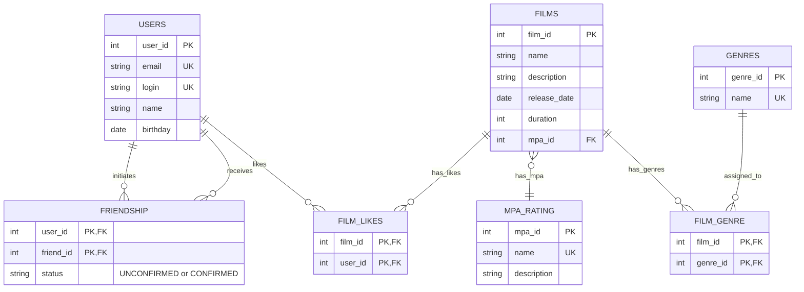

# java-filmorate

Приложение для оценки фильмов и управления списком друзей.

## Схема базы данных



### Обозначения связей на диаграмме

- **"initiates"** — пользователь инициирует дружбу (отправляет запрос)
- **"receives"** — пользователь получает запрос на дружбу
- **"likes"** — пользователь ставит лайки фильмам
- **"has_likes"** — фильм имеет лайки от пользователей
- **"has_mpa"** — фильм имеет рейтинг MPA
- **"has_genres"** — фильм имеет жанры
- **"assigned_to"** — жанр назначен фильмам

## Описание таблиц

### USERS

Хранит информацию о пользователях приложения.

### FRIENDSHIP

Связь между пользователями (дружба). Поддерживает два статуса:

- `UNCONFIRMED` — неподтверждённая (один пользователь отправил запрос)
- `CONFIRMED` — подтверждённая (второй пользователь принял запрос)

### FILMS

Основная информация о фильмах.

### MPA_RATING

Справочник рейтингов MPA (возрастные ограничения):

- G — нет ограничений
- PG — рекомендуется смотреть с родителями
- PG-13 — не желателен до 13 лет
- R — до 17 лет только с взрослым
- NC-17 — запрещён до 18 лет

### GENRES

Справочник жанров фильмов (Комедия, Драма, Мультфильм, Триллер, Документальный, Боевик).

### FILM_GENRE

Связь многие-ко-многим между фильмами и жанрами (у фильма может быть несколько жанров).

### FILM_LIKES

Лайки пользователей к фильмам.

## Примеры запросов

### Получение всех фильмов

```sql
SELECT f.*, mr.name as mpa_name
FROM films f
         JOIN mpa_rating mr ON f.mpa_id = mr.mpa_id
ORDER BY f.film_id;
```

### Получение фильма по ID с жанрами

```sql
SELECT f.*, mr.name as mpa_name, g.name as genre_name
FROM films f
         JOIN mpa_rating mr ON f.mpa_id = mr.mpa_id
         LEFT JOIN film_genre fg ON f.film_id = fg.film_id
         LEFT JOIN genres g ON fg.genre_id = g.genre_id
WHERE f.film_id = ?;
```

### Топ N наиболее популярных фильмов (по количеству лайков)

```sql
SELECT f.film_id,
       f.name,
       f.description,
       f.release_date,
       f.duration,
       mr.mpa_id,
       mr.name           as mpa_name,
       COUNT(fl.user_id) as likes_count
FROM films f
         JOIN mpa_rating mr ON f.mpa_id = mr.mpa_id
         LEFT JOIN film_likes fl ON f.film_id = fl.film_id
GROUP BY f.film_id, f.name, f.description, f.release_date, f.duration, mr.mpa_id, mr.name
ORDER BY likes_count DESC
LIMIT ?;
```

### Получение всех пользователей

```sql
SELECT *
FROM users
ORDER BY user_id;
```

### Получение пользователя по ID

```sql
SELECT *
FROM users
WHERE user_id = ?;
```

### Получение списка друзей пользователя

```sql
SELECT u.*
FROM users u
         JOIN friendship f ON u.user_id = f.friend_id
WHERE f.user_id = ?;
```

### Получение списка общих друзей двух пользователей

```sql
SELECT u.*
FROM users u
         JOIN friendship f1 ON u.user_id = f1.friend_id
         JOIN friendship f2 ON u.user_id = f2.friend_id
WHERE f1.user_id = ?
  AND f2.user_id = ?;
```

### Добавление лайка фильму

```sql
INSERT INTO film_likes (film_id, user_id)
VALUES (?, ?);
```

### Удаление лайка

```sql
DELETE
FROM film_likes
WHERE film_id = ?
  AND user_id = ?;
```

### Добавление друга (неподтверждённая дружба)

```sql
INSERT INTO friendship (user_id, friend_id, status)
VALUES (?, ?, 'UNCONFIRMED');
```

### Подтверждение дружбы

```sql
UPDATE friendship
SET status = 'CONFIRMED'
WHERE user_id = ?
  AND friend_id = ?;

UPDATE friendship
SET status = 'CONFIRMED'
WHERE user_id = ?
  AND friend_id = ?;
```

### Удаление из друзей

```sql
DELETE
FROM friendship
WHERE user_id = ?
  AND friend_id = ?;
```