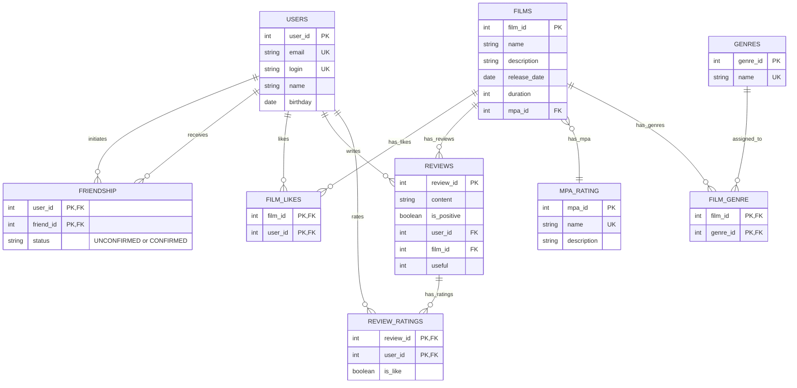

# java-filmorate

Приложение для оценки фильмов и управления списком друзей.

## Схема базы данных

### Обозначения связей на диаграмме

- **"initiates"** — пользователь инициирует дружбу (отправляет запрос)
- **"receives"** — пользователь получает запрос на дружбу
- **"likes"** — пользователь ставит лайки фильмам
- **"writes"** — пользователь пишет отзывы на фильмы
- **"rates"** — пользователь оценивает отзывы (лайк/дизлайк)
- **"has_likes"** — фильм имеет лайки от пользователей
- **"has_reviews"** — фильм имеет отзывы
- **"has_ratings"** — отзыв имеет оценки полезности
- **"has_mpa"** — фильм имеет рейтинг MPA
- **"has_genres"** — фильм имеет жанры
- **"assigned_to"** — жанр назначен фильмам

## Описание таблиц

### USERS

Хранит информацию о пользователях приложения.

### FRIENDSHIP

Связь между пользователями (дружба). Поддерживает два статуса:

- `UNCONFIRMED` — неподтверждённая (один пользователь отправил запрос)
- `CONFIRMED` — подтверждённая (второй пользователь принял запрос)

### FILMS

Основная информация о фильмах.

### MPA_RATING

Справочник рейтингов MPA (возрастные ограничения):

- G — нет ограничений
- PG — рекомендуется смотреть с родителями
- PG-13 — не желателен до 13 лет
- R — до 17 лет только с взрослым
- NC-17 — запрещён до 18 лет

### GENRES

Справочник жанров фильмов (Комедия, Драма, Мультфильм, Триллер, Документальный, Боевик).

### FILM_GENRE

Связь многие-ко-многим между фильмами и жанрами (у фильма может быть несколько жанров).

### FILM_LIKES

Лайки пользователей к фильмам.

### REVIEWS

Отзывы пользователей на фильмы. Каждый отзыв содержит:
- `review_id` — уникальный идентификатор
- `content` — текст отзыва
- `is_positive` — тип отзыва (положительный/отрицательный)
- `user_id` — автор отзыва
- `film_id` — фильм, к которому относится отзыв
- `useful` — рейтинг полезности (изменяется при добавлении лайков/дизлайков)

### REVIEW_RATINGS

Оценки полезности отзывов. Пользователи могут ставить лайки или дизлайки отзывам:
- `is_like = TRUE` — лайк (увеличивает рейтинг на 1)
- `is_like = FALSE` — дизлайк (уменьшает рейтинг на 1)

## SQL Запросы

Примеры SQL запросов для работы с базой данных доступны в файле [SQL.md](SQL.md)

## API

Подробная документация REST API доступна в файле [API.md](API.md)

## API

Подробная документация REST API доступна в файле [API.md](API.md).